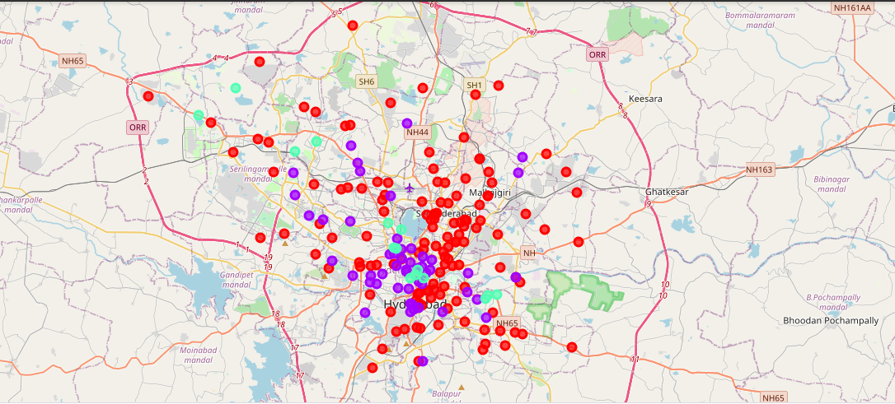

# Introduction
For many shoppers, visiting shopping malls is a great way to relax and enjoy themselves during weekends and holidays. Property developers are also taking advantage of this trend to build more shopping malls to cater to the demand. As a result, there are many shopping malls in the city of Hyderabad and many more are being built. Opening shopping malls allow property developers to earn consistent rental income. Of course, as with any business decision, opening a new shopping mall requires serious consideration and is a lot more complicated than it seems. Particularly, the location of the shopping mall is one of the most important decisions that will determine whether the mall will be a success or a failure.

# Business Problem
The objective of this capstone project is to analyze and select the best locations in the city of Hyderabad, India to open a new shopping mall. Using data science methodology and machine learning techniques like clustering, this project aims to provide solutions to answer the business question: In the city of Hyderabad,India if a property developer is looking to open a new shopping mall, where would you recommend that they open it?

# Data
To solve the problem, we will need the following data:  
• List of neighbourhoods in Hyderabad. This defines the scope of this project which is confined to the city of Hyderabad, the capital city of Telangana which is in South India  
• Latitude and longitude coordinates of those neighbourhoods. This is required in order to plot the map and also to get the venue data  
• Venue data, particularly data related to shopping malls. We will use this data to perform clustering on the neighbourhoods

# Sources of Data and methods to extract the Data
This Wikipedia page <a href="https://en.wikipedia.org/wiki/Category:Neighbourhoods_in_Hyderabad,_India">https://en.wikipedia.org/wiki/Category:Neighbourhoods_in_Hyderabad,_India</a> is a list of neighbourhoods in Hyderabad, with a total of 200 neighbourhoods. We will use web scraping techniques to extract the data from the Wikipedia page, with the help of
Python requests and beautifulsoup packages. Then we will get the geographical coordinates of the neighbourhoods using Python Geocoder package which will give us the latitude and longitude coordinates of the neighbourhoods. After that, we will use Foursquare API to get the venue data for those neighbourhoods. Foursquare API will provide many categories of the venue data, we are particularly interested in the Shopping Mall category in order to help us to solve the business problem put forward. This is a project that will make use of many data science skills, from web scraping (Wikipedia), working with API (Foursquare), data cleaning, data wrangling, to machine learning (K-means clustering) and map visualization (Folium).

# Methodology
Firstly, we need to get the list of neighbourhoods in the city of Hyderabad. Fortunately, the list is available in the Wikipedia page <a href="https://en.wikipedia.org/wiki/Category:Neighbourhoods_in_Hyderabad,_India">https://en.wikipedia.org/wiki/Category:Neighbourhoods_in_Hyderabad,_India</a> We will perform scraping using Python requests and beautifulsoup packages to extract the list of neighbourhoods data. However, this is just a list of names. We need to get the geographical coordinates in the form of latitude and longitude in order to be able to use Foursquare API. To do so, we will use the wonderful Geocoder package that will allow us to convert the address into geographical coordinates in the form of latitude and longitude. After gathering the data, we will populate the data into a pandas DataFrame and then visualize the neighbourhoods in a map using Folium package. This allows us to perform a sanity check to make sure that the geographical coordinates data returned by Geocoder are correctly plotted in the city of Hyderabad. With the data, we can check how many venues were returned for each neighbourhood and examine how many unique categories can be curated from all the returned venues and then we will analyse each neighbourhood.We will cluster the neighbourhoods into 3 clusters based on their frequency of occurrence for “Shopping Mall”. The results will allow us to identify which neighbourhoods have a higher concentration of shopping malls while which neighbourhoods have a fewer number of shopping malls. Based on the occurrence of shopping malls in different neighbourhoods, it will help us to answer the question as to which neighbourhoods are most suitable to open new shopping malls. Therefore, this project recommends property developers to capitalize on these findings to open new shopping malls in neighbourhoods in cluster 0 with little to no competition.

# Results
The results from the k-means clustering show that we can categorize the neighbourhoods into 3 clusters based on the frequency of occurrence for “Shopping Mall”: 
• Cluster 0: Neighbourhoods with no shopping malls  
• Cluster 1: Neighbourhoods with a moderate concentration of shopping malls  
• Cluster 2: Neighbourhoods with a very high concentration of shopping malls  
The results of the clustering are visualized in the map with cluster 0 in red colour, cluster 1 in purple colour, and cluster 2 in mint green colour.

# Conclusions
Property developers with unique selling propositions to stand out from the competition can also open new shopping malls in neighbourhoods in cluster 1 with moderate competition. Lastly, property developers are advised to avoid
neighbourhoods in cluster 2 which already have a high concentration of shopping malls and suffering from intense competition.

# References
• Category: Neighbourhoods in Hyderabad, India.Wikipedia.Retrieved from <a href="https://en.wikipedia.org/wiki/Category:Neighbourhoods_in_Hyderabad,_India">https://en.wikipedia.org/wiki/Category:Neighbourhoods_in_Hyderabad,_India</a>  
• Foursquare Developers Documentation,Foursquare. Retrieved from <a href="https://developer.foursquare.com/docs">https://developer.foursquare.com/docs</a>
